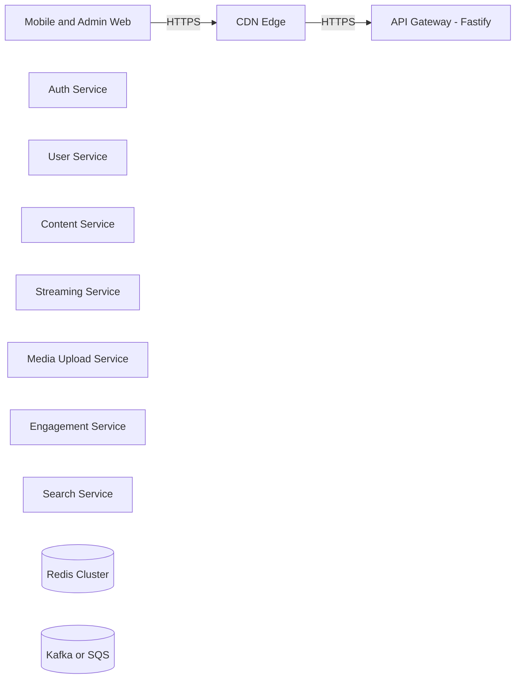
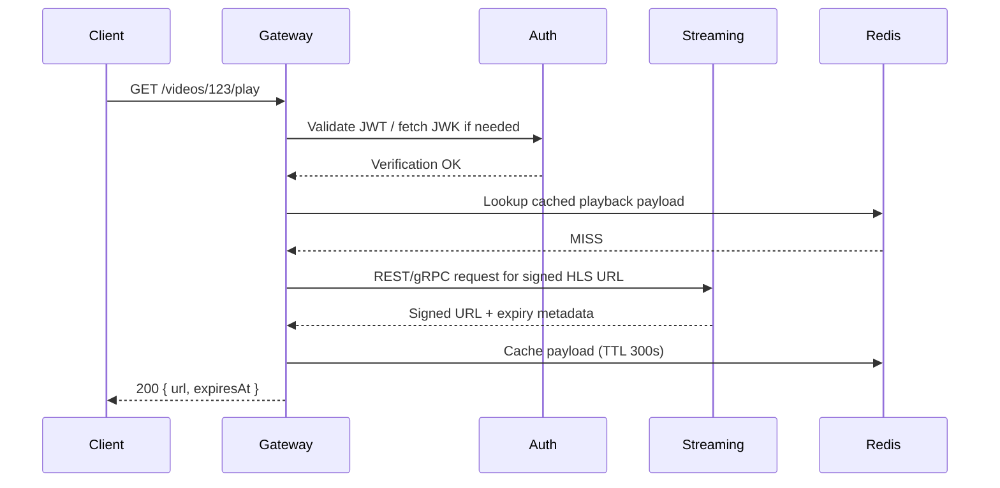

# PocketLOL API Gateway Architecture

## 1. Objectives

- Provide a single public entry point for mobile and web clients with CDN in front.
- Centralize authentication, authorization, rate limiting, request shaping, and routing.
- Support REST and gRPC protocols with internal service fan-out while remaining stateless.
- Shield downstream services, enforce zero-trust principles, and standardize observability across the estate.
- Deliver a containerized, horizontally scalable deployment that integrates with existing CI/CD and infrastructure primitives.

## 2. Non-Goals

- Implement business logic, domain validation, or data persistence within the gateway.
- Handle long-lived streaming or media relay; gateway issues signed URLs only.
- Manage service discovery or service mesh features beyond outbound routing configuration.
- Replace CDN edge caching or global traffic management capabilities.

## 3. High-Level Architecture



### 3.1 Deployment Topology

- API Gateway containers run behind a managed load balancer (e.g., AWS ALB, GCP LB) with CDN (CloudFront / Fastly) terminating TLS at the edge.
- Gateway pods/containers are stateless; scaling occurs via orchestration (Kubernetes/ECS/Nomad).
- Redis cluster resides in the same VPC/VNet for latency-sensitive rate limiting and metadata caching.
- Downstream services communicate over internal network links (VPC peering/service mesh) using HTTPS or mTLS.

## 4. Technology Decisions

| Concern            | Decision                                    | Notes |
|--------------------|----------------------------------------------|-------|
| Runtime            | Node.js 20 LTS                               | Aligns with long-term support and V8 optimizations. |
| Framework          | Fastify                                      | High-performance HTTP server with plugin ecosystem. |
| HTTP Client        | Undici                                       | Native HTTP client, optimized for Node.js. |
| Authentication     | JWT (RS256) via Auth service public keys      | Supports offline verification with JWK set caching. |
| Rate Limiting      | @fastify/rate-limit backed by Redis           | Tiered limits per identity class. |
| Caching            | Redis (metadata only)                        | TTL-based caching for signed URLs/expensive metadata. |
| Logging            | Pino via Fastify logger                      | Structured JSON logs ready for ELK/CloudWatch/Stackdriver. |
| Tracing            | OpenTelemetry SDK exporting to OTLP endpoint | Spans started in tracing plugin with child spans per proxy using shared HTTP utility. |
| Audit Events       | Custom Fastify plugin w/ HTTP sink           | Emits auth failures and rate-limit breaches to external compliance systems. |
| Config             | Typed zod loader + env toggles               | Route gating, service overrides, telemetry/audit controls. |

## 5. Request Handling Flow

### Example: Play Video (REST)



### Example: gRPC Fan-Out

1. Client issues REST POST /engagement/track.
2. Fastify handler validates payload, enriches headers.
3. Gateway invokes gRPC EngagementService.Track using @grpc/grpc-js with per-request metadata (user ID, correlation ID).
4. Response converted back to REST JSON payload for client.

## 6. Module and Folder Layout

```
api-gateway/
├── src/
│   ├── app.ts                  # Fastify instance configuration
│   ├── server.ts               # HTTP server bootstrap
│   ├── plugins/
│   │   ├── audit.ts            # Audit event publisher
│   │   ├── auth.ts             # JWT validation & authz hooks
│   │   ├── rate-limit.ts       # Redis-backed rate limiting + audit integration
│   │   ├── redis.ts            # Shared Redis connector
│   │   └── tracing.ts          # Correlation IDs + OpenTelemetry spans
│   ├── routes/
│   │   ├── auth.routes.ts      # Auth proxy surface (login)
│   │   ├── content.routes.ts   # Content metadata w/ Redis cache
│   │   ├── streaming.routes.ts # Playback endpoints
│   │   ├── upload.routes.ts    # Admin upload intents, status & quota
│   │   ├── engagement.routes.ts# Engagement events fan-out
│   │   └── search.routes.ts    # Catalog search proxy
│   ├── proxy/
│   │   ├── auth.proxy.ts       # Auth service HTTP proxy
│   │   ├── content.proxy.ts    # Content metadata proxy
│   │   ├── engagement.proxy.ts # Engagement event publisher
│   │   ├── search.proxy.ts     # Search proxy
│   │   ├── streaming.proxy.ts  # Playback proxy
│   │   └── upload.proxy.ts     # Upload orchestration w/ admin verification
│   ├── schemas/                # Zod schemas per domain
│   ├── utils/
│   │   ├── cache.ts            # Redis JSON helpers
│   │   ├── errors.ts           # Error mapping helper
│   │   └── http.ts             # Shared Undici proxy helper + telemetry
│   └── observability/
│       └── otel.ts             # OpenTelemetry SDK bootstrap
└── Dockerfile
```

## 7. Service Extension & Integration

### 7.1 Adding a New Service Namespace

1. **Define Schemas** – Create request/response Zod schemas under `src/schemas/<service>.schema.ts` to validate inbound payloads and downstream responses.
2. **Implement Proxy** – Add `src/proxy/<service>.proxy.ts` using `performServiceRequest` to fan out to the upstream. Use `resolveServiceUrl(<serviceKey>)` to honor environment overrides and pass `parentSpan` for observability.
3. **Expose Routes** – Register Fastify routes in `src/routes/<service>.routes.ts`, wiring authentication, rate limiting, and caching needs. Set `config.security.bodyLimit` for large payload constraints.
4. **Toggle via Config** – Update `ROUTE_KEYS`/`SERVICE_KEYS` in `src/config/index.ts` if introducing a brand-new key. Operators can then enable the namespace with `ROUTES_ENABLED` or disable via `ROUTES_DISABLED` without deploying new code.
5. **Document Environment Variables** – Extend `.env.example` with any new upstream URLs or feature flags.

This pattern keeps the gateway extensible; onboarding an internal API is primarily configuration and schema work, not core rewrites.

### 7.2 Runtime Configuration Controls

- **Route Toggles** – `ROUTES_ENABLED`/`ROUTES_DISABLED` gate plugin registration, supporting canaries or partial rollouts.
- **Service Overrides** – `SERVICE_ENDPOINT_OVERRIDES` allows targeting alternate backends (e.g., blue/green) by setting `search=https://search-canary.internal`.
- **Auth & Rate Policies** – Route `config` blocks specify `auth.public`, `rateLimitPolicy`, and custom rate-window overrides per handler.

### 7.3 Observability Hooks

- **Tracing** – `tracing` plugin issues inbound spans named `HTTP <verb> <route>`, while the shared HTTP utility emits child spans (`proxy:<service>`) capturing request metadata and status codes.
- **Audit Events** – `audit` plugin decorates `fastify.publishAuditEvent`, invoked by auth and rate-limit plugins to forward compliance events to the configured sink.
- **Correlation IDs** – Every request receives `x-correlation-id` propagation, included on downstream calls and responses.

## 8. Integration Contracts

### 8.1 Authentication Service

- Exposes JWKS endpoint for RS256 verification.
- Gateway caches JWKs with background refresh.
- Token payload must include `sub`, `roles`, `scopes`, `exp`.
- Gateway applies scope-based access control rules per route.

### 8.2 Streaming Service

- Provides REST `/internal/videos/:id/playback` or gRPC `PlaybackService` returning signed CDN URL and expiry.
- Gateway attaches `x-user-id`, `x-correlation-id`, and optional entitlement claims.
- Response cached in Redis for 5 minutes or `exp` minus safety buffer.

### 8.3 Audit Sink / Messaging

- Gateway publishes audit events (auth failures, throttles) via HTTP sink defined by `AUDIT_EVENT_SINK_URL`/`AUDIT_EVENT_SINK_TOKEN`.
- For future queue integration, wrap `publishAuditEvent` or extend the plugin to push to Kafka/SQS without affecting route handlers.

### 8.4 Upload Service

- Admin endpoints are exposed under `/api/v1/admin/uploads/*` for signing intents, polling status, and reading quota. Requests require the `admin` role and are further validated against User Service (`GET /api/v1/user/admin/users/{id}/context`) before proxying downstream.
- Gateway forwards `x-pocketlol-admin-id` and `x-pocketlol-admin-roles` headers to Upload Service so it can enforce admin-only access in tandem with the shared service token guard.
- Validation (`POST /internal/uploads/{uploadId}/validation`) and processing (`POST /internal/uploads/{uploadId}/processing`) callbacks originate from Streaming Service/preview workers and must present the platform `x-service-token` header. Upload Service rejects callbacks lacking the token.
- Upload events leverage Google Pub/Sub topics: `media.uploaded` (ingest success), `media.preview.requested` (preview generation trigger), and `media.processed` (manifests/thumbnails ready). Downstream services subscribe with standard Pub/Sub retry semantics (60s ack deadline, exponential redelivery up to five attempts).
- Preview generation metadata (duration, bitrate, manifest URL, default thumbnail) is persisted by Upload Service and surfaced via the admin status API as well as the `media.processed` event for Content Service ingestion.

## 9. Configuration & Secrets

- Environment variables supply external endpoints, credentials, and feature flags.
- Secrets delivered via platform secret manager (AWS Secrets Manager, GCP Secret Manager) injected at runtime.
- Use typed configuration loader to validate on boot; fail fast on missing values.

## 10. Observability

- Every request tagged with correlation ID (header `x-correlation-id` or generated UUIDv4).
- `src/observability/otel.ts` boots the OpenTelemetry SDK when `ENABLE_TELEMETRY=true`, wiring BatchSpanProcessor + OTLP exporter; spans gracefully shut down on process exit.
- `src/utils/http.ts` records downstream span attributes (URL, timeout, status) and propagates parent context from the request span.
- Audit trail events leverage the `audit` plugin to capture security-relevant signals even when telemetry is disabled.
- Logging: structured log entries with request ID, user ID (hashed), route, status, latency, error stack (if any).

## 11. Security Controls

- Enforce HTTPS only; redirect or reject plaintext traffic at load balancer/CDN.
- JWT validation with automatic key rotation and clock skew tolerance.
- Role/scope checks defined per route configuration.
- Input validation via JSON schema (AJV) before proxying downstream.
- Outbound requests use mTLS or mutual auth where supported.
- Strict timeout and circuit breaker settings to prevent cascading failures.

## 12. Implementation Phases

1. **Foundation** – Fastify bootstrap, config loader, health routes, logging, graceful shutdown.
2. **Auth & Rate Limiting** – JWT validation, JWK caching, tiered limits, correlation IDs, audit logging.
3. **Service Routing Expansion** – REST routes, shared HTTP utility, Redis caching, route/service toggles.
4. **Observability & Security** – OpenTelemetry exporter wiring, audit plugin, hardened headers/body limits.
5. **Tooling & Release Readiness** – Docker image, docker-compose stack, static analysis gates.

## 13. Future Enhancements

- Confirm transport encryption requirements for service-to-service calls (mTLS vs mutual auth headers).
- Decide on managed Redis/Kafka offerings vs self-hosted clusters.
- Validate CDN strategy for signed URL issuance (CloudFront vs custom OME distribution).
- Establish SLA/SLO targets and error budgets for the gateway tier.
