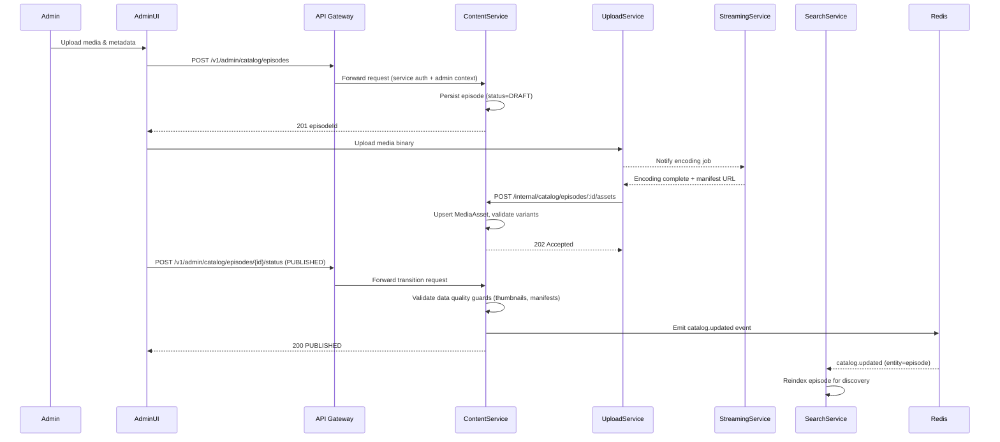
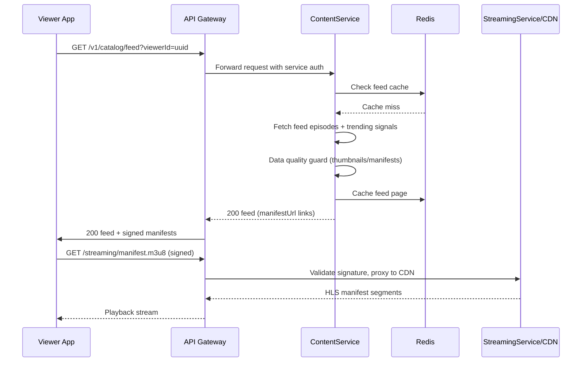

# End-to-End Sequence Diagrams

## Admin Ingestion (Upload → Streaming → Catalog Publish)


```mermaid
sequenceDiagram
  participant Admin
  participant AdminUI
  participant APIGW as API Gateway
  participant Content as ContentService
  participant Upload as UploadService
  participant Streaming as StreamingService
  participant Search as SearchService

  Admin->>AdminUI: Upload media & metadata
  AdminUI->>APIGW: POST /v1/admin/catalog/episodes
  APIGW->>Content: Forward request (service auth + admin context)
  Content->>Content: Persist episode (status=DRAFT)
  Content-->>AdminUI: 201 episodeId

  AdminUI->>Upload: Upload media binary
  Upload-->>Streaming: Notify encoding job
  Streaming-->>Upload: Encoding complete + manifest URL
  Upload->>Content: POST /internal/catalog/episodes/:id/assets
  Content->>Content: Upsert MediaAsset, validate variants
  Content-->>Upload: 202 Accepted

  AdminUI->>APIGW: POST /v1/admin/catalog/episodes/{id}/status (PUBLISHED)
  APIGW->>Content: Forward transition request
  Content->>Content: Validate data quality guards (thumbnails, manifests)
  Content->>Redis: Emit catalog.updated event
  Content-->>AdminUI: 200 PUBLISHED
  Redis-->>Search: catalog.updated (entity=episode)
  Search->>Search: Reindex episode for discovery
```

## Viewer Playback (Gateway → Content → Streaming)


```mermaid
sequenceDiagram
  participant App as Viewer App
  participant APIGW as API Gateway
  participant Content as ContentService
  participant Redis
  participant Stream as StreamingService/CDN

  App->>APIGW: GET /v1/catalog/feed?viewerId=uuid
  APIGW->>Content: Forward request with service auth
  Content->>Redis: Check feed cache
  Redis-->>Content: Cache miss
  Content->>Content: Fetch feed episodes + trending signals
  Content->>Content: Data quality guard (thumbnails/manifests)
  Content->>Redis: Cache feed page
  Content-->>APIGW: 200 feed (manifestUrl links)
  APIGW->>App: 200 feed + signed manifests

  App->>APIGW: GET /streaming/manifest.m3u8 (signed)
  APIGW->>Stream: Validate signature, proxy to CDN
  Stream-->>APIGW: HLS manifest segments
  APIGW-->>App: Playback stream
```

```
