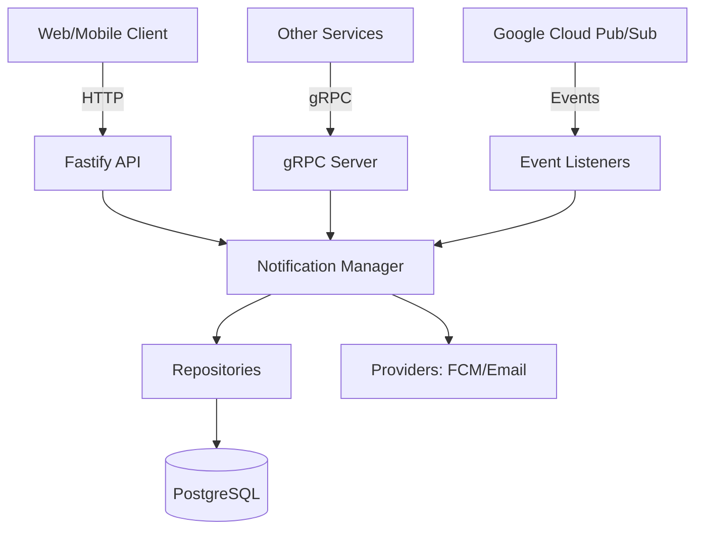

# Notification Service Documentation

The **Notification Service** is a core microservice in the OMGTV architecture responsible for managing and delivering multi-channel notifications (Push, Email, and In-App) to users. It supports both transactional notifications and scheduled marketing campaigns.

## 🚀 Overview

- **Framework**: Fastify (HTTP), gRPC (Internal Communication)
- **Database**: PostgreSQL with Prisma ORM
- **Communication**: Google Cloud Pub/Sub (Event-driven), gRPC
- **Push Provider**: Firebase Cloud Messaging (FCM)
- **Email Provider**: Console-based (Extendable to SendGrid/SES)

---

## 🏗️ Architecture

The service follows a layered architecture for maintainability and scalability.



### Key Components

- **`NotificationManager`**: Central orchestrator that checks user preferences, persists notification state, and dispatches to providers.
- **`CampaignService`**: Handles the execution and scheduling of bulk notification campaigns.
- **`PushNotificationService`**: specialized logic for handling FCM tokens, topics, and batch sends.
- **`Repositories`**: Abstracted database access using Prisma.
- **`Providers`**: Interfaces for third-party delivery services (FCM, Email).

---

## 🛠️ Key Features

### 1. Multi-Channel Support

- **Push**: Integrated with Firebase Cloud Messaging.
- **Email**: Currently console-based for development.
- **In-App**: Persistent storage for user-facing notification lists.

### 2. Campaign Management

Allows administrators to create, schedule, and execute notification campaigns.

- **Statuses**: `DRAFT`, `SCHEDULED`, `SENDING`, `COMPLETED`, `CANCELLED`.
- **Granular Tracking**: Tracks `sentCount` and `failedCount` per campaign.

### 3. User Preferences

Users can opt-in or out of specific notification channels via the `UserNotificationPreference` model.

### 4. Event-Driven Notifications

Listens to Pub/Sub events (e.g., `user.registered`) to trigger automated transactional messages.

---

## 📡 API Reference (REST)

| Endpoint                                    | Method | Description                       |
| :------------------------------------------ | :----- | :-------------------------------- |
| `/api/v1/notifications`                     | GET    | List user notifications           |
| `/api/v1/notifications/:id/read`            | PATCH  | Mark notification as read         |
| `/api/v1/notifications/unread-count`        | GET    | Get count of unread notifications |
| `/api/v1/notifications/read-all`            | PATCH  | Mark all as read                  |
| `/api/v1/preferences`                       | GET    | Get user preferences              |
| `/api/v1/preferences`                       | PATCH  | Update user preferences           |
| `/api/v1/notifications/push/send`           | POST   | Send push to specific user        |
| `/api/v1/notifications/push/topic`          | POST   | Send push to a topic              |
| `/api/v1/notifications/push/register-token` | POST   | Register FCM token                |
| `/api/v1/admin/notifications/send`          | POST   | Admin: Send targeted notification |
| `/api/v1/admin/notifications/broadcast`     | POST   | Admin: Broadcast to all           |
| `/api/v1/admin/campaigns`                   | GET    | List campaigns                    |
| `/api/v1/admin/campaigns`                   | POST   | Create a new campaign             |
| `/api/v1/admin/campaigns/:id/execute`       | POST   | Manually trigger a campaign       |

---

## 💻 CURL Examples

### User Notifications

**List Notifications**

```bash
curl -X GET "http://localhost:5200/api/v1/notifications?limit=10&offset=0" \
     -H "x-user-id: YOUR_USER_UUID"
```

**Mark as Read**

```bash
curl -X PATCH "http://localhost:5200/api/v1/notifications/NOTIFICATION_ID/read" \
     -H "x-user-id: YOUR_USER_UUID"
```

### User Preferences

**Get Preferences**

```bash
curl -X GET "http://localhost:5200/api/v1/preferences" \
     -H "x-user-id: YOUR_USER_UUID"
```

**Update Preferences**

```bash
curl -X PATCH "http://localhost:5200/api/v1/preferences" \
     -H "Content-Type: application/json" \
     -H "x-user-id: YOUR_USER_UUID" \
     -d '{
       "emailEnabled": true,
       "pushEnabled": false
     }'
```

### Push Management

**Register FCM Token**

```bash
curl -X POST "http://localhost:5200/api/v1/notifications/push/register-token" \
     -H "Content-Type: application/json" \
     -d '{
       "userId": "YOUR_USER_UUID",
       "token": "FCM_DEVICE_TOKEN",
       "platform": "android"
     }'
```

**Send Push to User**

```bash
curl -X POST "http://localhost:5200/api/v1/notifications/push/send" \
     -H "Content-Type: application/json" \
     -d '{
       "userId": "YOUR_USER_UUID",
       "title": "Hello!",
       "body": "This is a test push notification"
     }'
```

### Admin & Campaigns

**Create Campaign**

```bash
curl -X POST "http://localhost:5200/api/v1/admin/campaigns" \
     -H "Content-Type: application/json" \
     -d '{
       "name": "Welcome Campaign",
       "title": "Welcome to OMGTV",
       "body": "Enjoy your free trial!",
       "type": "PUSH"
     }'
```

**Execute Campaign**

```bash
curl -X POST "http://localhost:5200/api/v1/admin/campaigns/CAMPAIGN_ID/execute"
```

**Broadcast Notification**

```bash
curl -X POST "http://localhost:5200/api/v1/admin/notifications/broadcast" \
     -H "Content-Type: application/json" \
     -d '{
       "title": "System Update",
       "body": "We will be down for maintenance at 2 AM.",
       "priority": "HIGH"
     }'
```

---

## 🔗 Internal Integration (gRPC)

The service exposes a gRPC server (Port 50072) for high-performance internal communication.

**Service Definition**: `NotificationService`

- `SendNotification`: Triggers a single notification to a user.
- `UpdatePreferences`: Updates user-specific notification settings.

---

## 🏗️ Campaign System Details

### Campaign Lifecycle

The service manages campaigns through a strict set of state transitions to ensure reliability and auditability.

**States:**

- `DRAFT`: Initial state, editable.
- `SCHEDULED`: Waiting for execution at a specific time.
- `SENDING`: Currently being processed in batches.
- `COMPLETED`: All batches processed successfully.
- `CANCELLED`: Manually stopped by admin.
- `FAILED`: Execution stopped due to a critical error.

**Transitions:**

- `DRAFT` → `SCHEDULED` / `SENDING`
- `SCHEDULED` → `SENDING` (Automatic via scheduler)
- `SENDING` → `COMPLETED` / `FAILED`

### Campaign Execution Flow

1. **Trigger**: Campaign is picked up by the scheduler or triggered via Admin API.
2. **Idempotency**: Service checks the `idempotencyKey` to prevent duplicate runs.
3. **Status Update**: Campaign status set to `SENDING`.
4. **Batch Fetching**: User tokens are fetched from the database in batches of 500.
5. **Push Dispatch**: The `PushNotificationService` sends the batch to FCM with internal retry logic.
6. **Stat Tracking**: `sentCount` and `failedCount` are updated incrementally in the database.
7. **Notification Logging**: Individual `Notification` records are created for each user in the batch.
8. **Finalization**: Status set to `COMPLETED` once all batches are done.

---

## 📈 Scalability Strategy

- **Batch Processing**: Campaigns are processed in chunks of 500 users to prevent memory overflow and database locking.
- **Stateless Workers**: All service logic is stateless, allowing horizontal scaling of the Fastify/gRPC containers.
- **Database Optimization**:
  - `@@index([status])` on campaigns for fast scheduler lookups.
  - `@@index([createdAt])` for efficient reporting.
- **Push Throttling**: The service respects FCM multicast limits (500 tokens/request) and includes subtle delays if needed between batches.

---

## 🛡️ Error Handling & Retry Strategy

- **FCM Retries**: Transient failures (e.g., 503 Service Unavailable) are retried with **Exponential Backoff** (up to 3 times).
- **Idempotency**: Unique `idempotencyKey` prevents duplicate notifications if the same campaign is triggered twice.
- **Graceful Failure**: If a batch fails partially, the service logs the error per-token and continues with the rest of the campaign.
- **Dead-Letter Handling**: Critical infrastructure failures are logged as `FAILED` status for manual intervention.

---

## 🔒 Security

- **RBAC (Role Based Access Control)**: Admin endpoints are protected via `requireAdmin` preHandler hook. Requries `x-user-role: admin` header.
- **Service Auth**: gRPC and internal methods are validated using the `SERVICE_AUTH_TOKEN`.
- **Input Validation**: All APIs use Zod schemas for strict request validation and sanitized input.
- **Connection Security**: Database and Firebase connections are configured with SSL/TLS in production.

---

## 👁️ Monitoring & Observability

### Health Checks

- `/health`: Performs a real-time database connectivity check (`SELECT 1`) and verifies Firebase initialization.

### Logging

- **Structured Logging**: Uses `pino` for high-performance JSON logging.
- **Contextual Data**: All logs include `campaignId`, `userId`, and `correlationId` where applicable for easy tracing.

### Metrics (TBD)

- Integration with Prometheus/Grafana is planned for tracking `notifications_sent_total` and `fcm_latency_ms`.

---

## 🐳 Deployment & Configuration

### Docker Integration

The service is fully containerized and integrated into the project's orchestration.

- **Dockerfile**: Multi-stage build (Alpine-based).
- **Compose**: Included in `docker-compose.yml` for local dev and `docker-compose.deploy.yml` for production.

### Environment Variables

- `DATABASE_URL`: PostgreSQL connection string.
- `REDIS_URL`: Redis connection for Pub/Sub and caching.
- `FIREBASE_SERVICE_ACCOUNT_PATH`: Path to the FCM credentials JSON.
- `SERVICE_AUTH_TOKEN`: Secret for cross-service authentication.
