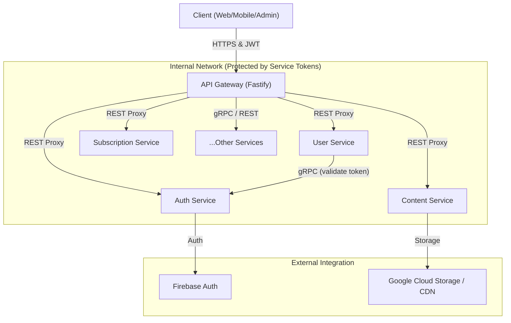

# OMGTV Routes Architecture

This document provides a comprehensive overview of the routing structure within the OMGTV microservices ecosystem. It explains how requests are routed from the public API Gateway to individual services and how those services communicate with each other.

---

## 🏗️ Routing Architecture

The system follows a **Gateway Aggregator** pattern. All client requests (Mobile, Web, Admin) hit the **API Gateway (APIGW)** first. The Gateway is responsible for:
1.  **Authentication & Authorization**: Validating JWTs and checking user roles.
2.  **Rate Limiting**: Protecting services from abuse.
3.  **Routing/Proxying**: Forwarding requests to the appropriate backend service.
4.  **Data Enrichment**: Aggregating data from multiple services (e.g., merging Content metadata with Engagement stats).

### 🚦 Traffic Flow


---

## 📋 Service Registry (Quick Reference)

Most services are mapped dynamically in `APIGW/src/config/services.ts`.

| Service | Gateway Base Path | Internal Target | Access Level | Description |
| :--- | :--- | :--- | :--- | :--- |
| **Auth** | `/api/v1/auth` | `auth-service:3001` | Public | Login, Registration, Tokens |
| **User** | `/api/v1/user` | `user-service:3002` | Authenticated | Profiles, Permissions, Admin |
| **Content**| `/api/v1/content`| `content-service:3003`| Authenticated*| Catalog, Metadata, Carousels |
| **Search** | `/api/v1/search` | `search-service:3004` | Public | ElasticSearch wrapper |
| **Engagement**| `/api/v1/engagement`| `engagement-service:3005`| Authenticated| Likes, Saves, Views, Progress |
| **Streams** | `/api/v1/streams` | `streaming-service:3006`| Authenticated| Playback manifests (HLS/DASH) |
| **Subscription**| `/api/v1/subscription`| `subscription-service:3007`| Authenticated| Plans, Purchases, Stripe |
| **Notifications**| `/api/v1/notifications`| `notification-service:3008`| Authenticated| Push, In-app alerts |
| **Upload** | `/api/v1/admin/uploads`| `upload-service:3009` | Admin | Asset ingestion orchestration |

*\* Some content routes (Catalog) are marked as public.*

---

## 🔗 Inter-Service Communication

Services communicate using two primary protocols:

### 1. gRPC (High Performance)
Used for critical path operations that require low latency and strict typing.
- **Example**: When the `APIGW` or `UserService` needs to validate a user ID, it calls `AuthService` via gRPC.
- **Proto Definitions**: Located in `proto/` directories within each service.
  - `AuthService.ValidateToken`: Fast validation of JWT signatures.
  - `AuthService.GetUserById`: Fetch basic user identity data.

### 2. REST (HTTP/1.1)
Used for data proxying and enrichment where complex payloads or third-party libraries (like Fastify-proxy) are involved.
- **Service Tokens**: Every internal request is signed with an `X-Service-Token` (defined in `.env`). Services verify this token to ensure the request came from another trusted service (usually the Gateway), not the public internet.

---

## 🛠️ Adding a New Route: Developer Guide

When you need to expose a new feature, follow this checklist:

### Step 1: Implement the Route in the Service
Create the endpoint in your service (e.g., `RecommendationService`).
```typescript
// RecommendationService/src/routes/personalized.ts
fastify.get("/api/v1/recommendations/personalized", async (req, reply) => {
  // logic...
});
```

### Step 2: Map the Route in the Gateway
Choose the mapping strategy based on your needs:

#### Option A: Simple Proxy (Recommended for Standard CRUD)
Add the service to `APIGW/src/config/services.ts`.
```typescript
{
  name: "recommendation",
  displayName: "Recommendation Service",
  basePath: "/api/v1/recommendations",
  target: resolveServiceUrl("recommendation"),
  access: "authenticated",
  internalBasePath: "/api/v1/recommendations",
}
```
*The Gateway will now automatically forward `/api/v1/recommendations/*` to your service.*

#### Option B: Custom Route Handler (For Data Enrichment)
If you need to merge data from other services (e.g., merging recommendations with video metadata), create a custom handler in `APIGW/src/routes/`.
1. Define a Zod schema in `APIGW/src/schemas/`.
2. Implement the proxy logic in `APIGW/src/proxy/`.
3. Register the route in `APIGW/src/routes/recommendation.routes.ts`.

### Step 3: Secure the Route
- **Client Access**: Gateway checks for a valid JWT via `preHandler: [fastify.authorize([...])]`.
- **Internal Security**: Your service should check for `req.headers['x-service-token']`.

---

## 📖 Detailed Route Reference (Top Level)

### 🔐 Auth Service
- `POST /api/v1/auth/customer/login`: Log in via Firebase.
- `POST /api/v1/auth/admin/login`: Admin dashboard entry.
- `POST /api/v1/auth/token/refresh`: Issue new access tokens.
- `POST /api/v1/auth/guest/init`: Generate a guest session for anonymous browsing.

### 🎬 Content Service
- `GET /api/v1/content/:id`: Fetch full metadata and playback info for a Video/Episode/Series.
- `GET /api/v1/content/catalog/mobile`: Fetch customized catalog for mobile apps.
- `POST /api/v1/content/admin/catalog/carousel`: Update home-screen banners.

### 📈 Engagement Service
- `POST /api/v1/engagement/like`: Upvote content.
- `POST /api/v1/engagement/view`: Track view counts (increment stats).
- `POST /api/v1/engagement/progress`: Save playback progress for "Resume Watching".
- `GET /api/v1/engagement/analytics/dashboard`: [ADMIN] View platform-wide stats.

---

> [!NOTE]
> This document is automatically generated based on the service registry and routing definitions. For specific parameters and response schemas, refer to the **Swagger UI** at `https://api.omgtv.dev/docs`.
